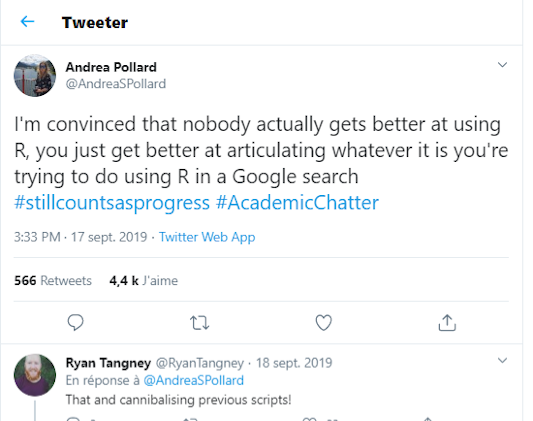
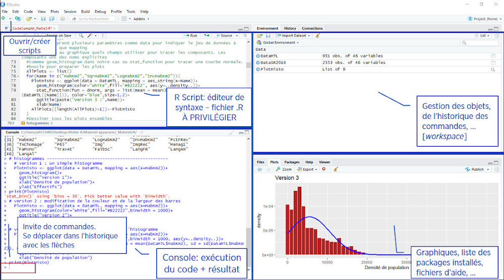
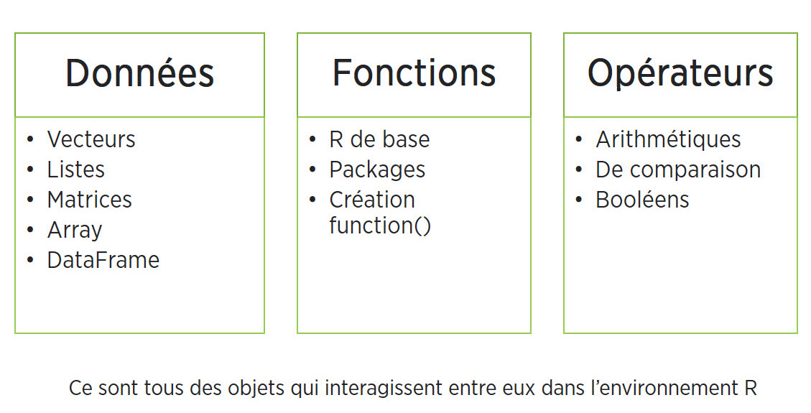

```{r setup, include=FALSE}
knitr::opts_chunk$set(echo = FALSE)
```


## Objectifs

####### - Maitriser l'environnement de RStudio.{.fragment .fade-right}

<br>

####### - S'initier à la grammaire de base du langage R.{.fragment .fade-right}

<br>

####### - Définir et manipuler différents types d'objets avec des opérateurs.{.fragment .fade-right}

<br>

####### - Importer et explorer un jeu de données.{.fragment .fade-right}

<br>

####### - Comprendre le fonctionnement et l'utilisation de fonctions élémentaires et de leurs arguments.{.fragment .fade-right}


<br>

<br>

####### - Utilisation de la base de données hdv2003 (INSEE) du package `questionr` {.fragment .fade-right}


## 1. Pourquoi **R**? 


- Langage et interface de programmation libres et gratuits pour l’analyse statistique et graphique (etc.).

- Multiplateforme : Windows, Mac, Linux.

- Très fort pour les graphiques et visualisations de toutes sortes.

- Communauté très active donc développement constant = rapidité de l’implémentation de nouvelles méthodes (non disponibles dans les logiciels commerciaux).

- Pour tous les types d’analyses (modèles linéaires, multi-niveaux, analyses factorielles, équation structurelle, simulations, psychométrie, économétrie, génomique...).

- Utilisation de scripts assure la reproductibilité des analyses.

- Très efficace pour la création de présentations et de rapports (`Rmarkdown`, `knitr`, `LaTeX`).

- Excellente intégration avec de nombreux systèmes de bases de données,  autres langages et outils comme Colab ou Jupyter notebook (en association avec Python).


## 1. Pourquoi **R**? 

<center>


</center>

## 2. Quelques bémols  

- Plus un langage de programmation qu’un logiciel.

- Ne manipule pas directement les données comme SPSS ou excel, les fichiers de données sont des objets en mémoire.

- L’affichage des résultats est assez minimaliste.

- Prolifération des fonctions (*packages*) peut alourdir l’apprentissage.

- Développement rapide fait que la documentation laisse parfois à désirer.

- Contient généralement de l’aide pour toutes les fonctions mais pas toujours facile à comprendre.

- Comme pour tout language de programmation, un "rien" peut faire en sorte que le code plante.

- Bref, complexe mais TRÈS puissant!


## 2. Quelques bémols 

### Stratégie d'attaque

1. Choisir ses combats (on n'apprend pas R, on apprend ce que l'on a à faire dans R)

2. Savoir trouver des réponses à ses questions


 


## 3. R, RStudio et autres interfaces 

- Interface du **R** de base pas très intuitive donc peu utilisée telle quelle  

<center>


</center>  

- Installe généralement en plus un <span class="fragment highlight-red">IDE,  *Integrated Development Environment*</span>:  éditeur de script - environnement beaucoup plus convivial qui facilite le travail (gestion des fichiers, objets et commandes, historique de fonctions, autocomplétion,…).

- L’IDE le plus utilisé est **RStudio** (mais il y en a d’autres comme **Tinn-R**).

- Les commandes et fonctions sont les mêmes pour **R** et **RStudio**.


## 4. Installation  

1. Télécharger et installer [**R de base**](https://cran.r-project.org/) - choisir son système d’exploitation et suivre les étapes.

2. Télécharger et installer  [**RStudio**](https://www.rstudio.com/products/rstudio/download/#download) (ou autre interface) – Choisir la version gratuite et son système d’exploitation.

3. Télécharger et installer ("charger") des *packages* dans **RStudio**.

<br>

- À noter
    + Pas de mises à jour automatiques, il faut installer une nouvelle version et retélécharger les *packages* (ou déplacer le répertoire de l’ancienne version et faire `update.packages`). **RStudio** utilisera par défaut la version la plus récente sur le poste (peut se faire manuellement). L'ancienne version peut être désinstallée. Il est recommandé de mettre à jour sa version R et RStudio annuellement.
    + Certains besoins plus spécialisés peuvent nécessiter l'installation d'outils supplémentaires comme [*RTools* (Windows) et *LaTeX*](http://cran.r-project.org/doc/manuals/R-admin.html#The-Windows-toolset).


## 5. Qu’est-ce qu’un *package*? 

<br>

- Un *package* est un module (ou extension, librairie, bibliothèque) qui contient un ensemble de fonctions (souvent liées à une méthode ou un domaine particulier).

- À l’installation, **R** vient avec un ensemble de fonctions de base {base} et de modules par défaut (*built in packages*).

- Des *packages* composés de fonctions spécialisées sont constamment développés par la communauté.

- On en trouve plus de 15 000 sur le site officiel de **R** [CRAN](https://cran.r-project.org/web/packages/). D'autres se trouvent aussi ailleurs (Github, …).

- Les packages doivent être <span class="fragment highlight-red">**téléchargés**</span> une seule fois, mais <span class="fragment highlight-red">**chargés**</span>  à chaque session.

```{r, echo = TRUE, eval= FALSE}
# Installer (télécharger) un module
install.packages("psych")

# Charger (activer) un module
library(psych) 
# ou 
require(psych)
```

## 5. Qu’est-ce qu’un *package*? (suite)  

<br>

- Il y a toujours plusieurs façons d’arriver au même résultat -> normal et nécessaire de se limiter à certaines fonctions.

- Les modules sont généralement évalués par les pairs - [Journal of Statistical Software](https://www.jstatsoft.org/index) – le choix doit se faire avec précautions.

- Comment les trouver et les choisir? En cherchant sur Google! En s’informant dans son domaine et en vérifiant si les packages ont déjà été utilisés dans des publications.

- Certains packages ont des façons spécifiques de fonctionner. Ils utilisent une syntaxe et des formats qui se distinguent de la syntaxe commune de **R**. 


## 6. Tidyverse {.smaller}
 <center>


</center>  

- Ensemble de packages très utilisé spécialisé dans l’analyse, la manipulation et la visualisation de données -> repose sur le principe de  [*tidy data*](https://www.jstatsoft.org/article/view/v059i10).
- Les packages Tidyverse partagent une syntaxe commune et des "verbes" et opérateurs spécifiques (ex: %>%). 
- Travaillent avec un format de jeu de données particulier (*tibble*) – variation sur le dataframe.
- La commande `install.packages("tidyverse")` va télécharger toutes les extensions constituants le cœur de tidyverse. La fonction library(tidyverse) les chargera (Certains autres modules doivent être chargés individuellement) :
    + dplyr (manipulation des données)
    + tidyr (remise en forme des données)
    + purrr (programmation)
    + readr (importation de données)
    + tibble (tableaux de données)
    + forcats (variables qualitatives)
    + stringr (chaînes de caractères)
    + ggplot2 (visualisation)

- Voir [R for data science](https://r4ds.had.co.nz/index.html) de Grolemund & Wickham

## 6. Packages Géo/Carto

<div style="position: fixed; top: 0; right: 0;">

</div>

<br>

- [SF](https://r-spatial.github.io/sf/)   
- [SP](https://www.rdocumentation.org/packages/sp/versions/1.4-5)   
- [Raster](https://www.rdocumentation.org/packages/raster/versions/3.4-5)   
- [Leaflet](https://rstudio.github.io/leaflet/)   
- [Cartography](https://www.rdocumentation.org/packages/cartography/versions/2.4.2)   
- [Tmap](https://cran.r-project.org/web/packages/tmap/vignettes/tmap-getstarted.html)   
- [Mapview](https://r-spatial.github.io/mapview/)   
- [RQGIS](https://www.rdocumentation.org/packages/RQGIS/versions/1.0.4)

<br>

[The R Graph Gallery](https://www.r-graph-gallery.com/)   
[*Geocomputation with R*](https://geocompr.robinlovelace.net/)   
[*Données géospatiales et cartographie avec R*](https://roelandtn.frama.io/slides/2090628_meetup_Raddict_datageo.html#1)   
[*Spatial Data Science with applications in R*](https://keen-swartz-3146c4.netlify.app/)   
[*CRAN Task View: Analysis of Spatial Data*](https://cran.r-project.org/web/views/Spatial.html)   
[Making Maps with R](https://bookdown.org/nicohahn/making_maps_with_r5/docs/introduction.html)  [github](https://github.com/nicoFhahn/making_maps_with_r)


## 7. Interface **RStudio**  

<center>



</center>  
  - **À noter**:
    + On ne peut conserver l'historique complet à partir de la console, donc il est préférable de travailler à partir d'un script.
    + l'*invite de commande* se transforme parfois en +, **R** considère alors que la ligne de commande n'est pas complète. Pour en sortir, taper sur *esc*.

    
## 7. Interface **RStudio** (suite)

### Raccourcis pratiques  

- **Éditeur de script**:
    + **Ctrl + Entrée est votre meilleur ami!** : exécute code dans le script ligne par ligne.
    + Ctrl + 2: déplace curseur dans la console.

- **Console**:
    + Ctrl + 1 : déplace le curseur dans l’éditeur.
    + Ctrl + L : vide la console
    + Flèche vers le haut et bas du clavier: historique des commandes précédentes.

- Onglet History du quadrant haut-droite: consulter et relancer commandes.

- Autocomplétion: Tab dans le nom d’une fonction. Aussi pour noms d’objets.

- Nombreux autres raccourcis sous les onglets *View*, *Edit* et *Code*
  
## 8. Les projets et autres fichiers dans **RStudio** 

- Créer un projet: menu *File* puis sélectionner *New project*.

- Un projet permet d’organiser son travail et de faciliter l’accès à un ensemble de fichiers (données, scripts, documentation, graphiques...) organisés dans des dossiers/sous-dossiers.

- Un projet **RStudio** est associé à un répertoire de travail **R**: on peut créer un nouveau dossier ou créer un projet à partir d’un dossier existant - *Working Directory*.

- **R** va créer dans ce dossier un fichier **.Rproj**. Ce fichier sera ensuite automatiquement chargé dans **RStudio** à l’ouverture entrainant la définition du dossier de travail, le chargement du fichier .Rdata (image contenant les objets), le chargement de l'historique et l’ouverture des scripts ouverts à la dernière session. 

- Plusieurs projets peuvent être ouverts en même temps.

- Les options générales et de projets de RStudio peuvent être modifiées sous *Tools > Global Options...* et *Tools >  Project options*.

- Même si l’on ne travaille pas dans le cadre d’un "projet", **R** demandera à la fermeture si l’on veut enregistrer ce qui se trouve dans son environnement. Si oui, les objets seront enregistrés dans un fichier **.Rdata**, le script dans un fichier **.R** et les commandes dans un fichier **.Rhistory**. À la prochaine ouverture **R** ouvrira comme au dernier enregistrement.

## 7. **R**: Langage de programmation  


- **R** est avant tout un langage de programmation <span class="fragment highlight-red">orienté objet</span>.

- Développé à partir du **langage S** par *Ross Ihaka* et *Robert Gentleman* au cours des années ‘90.

- Permet de programmer ses propres fonctions et packages.  

<center>


####### *Est-ce qu'il faut vraiment apprendre ça?* {.fragment .fade-up .highlight-red}

</center>  


## 7. **R**: Langage de programmation (suite)  


**Particularités à savoir**:

- Sensible à la casse (attention minuscules/majuscules).

- Sensible aux accents (éviter d’utiliser).

- Sensible aux signes de ponctuation: point pour décimales, virgule pour adressage.

- Non sensible aux espaces.

- Attention aux guillemets (pour texte, simple ou double), crochets, accolades, parenthèses.

- Une ligne par commande, ou séparer plusieurs commandes par ;.

- Importance fondamentale de documenter son code avec  # 
`# ceci est un commentaire (peut ajouter section en suivant avec au moins 4 ----)`
    
- Contrairement aux autres logiciels, l’analyse se fait par une série d’étapes avec des résultats intermédiaires <span class="fragment highlight-red">stockés dans des objets</span>.


## 8. Structure de base du langage **R**: Objets  


<center>



</center>  

## 8. Structure de base du langage **R**: Objets  

### Les opérateurs

 
<center> 

 

</center> 

## 8. Structure de base du langage **R**: Objets (suite) 

<br>

À la base, on peut utiliser **R** comme une grosse calculatrice:

```{r, echo = TRUE}
2+2
```


**WOW!**

<br>

- Mais l’intérêt du langage est que l’on stocke les valeurs, les tableaux, résultats, fonctions, ... dans des **objets** qui pourront être réutilisés dans d’autres objets, fonctions, analyses.

<center>


</center>  


## 8. Structure de base du langage **R**: Objets (suite)  

- On veut calculer la moyenne d'âge de trois personnes de 12, 15 et 20 ans

```{r, echo = TRUE}
(12+15+20)/3  
```

<br>

- Créer un objet avec <span class="fragment highlight-red">l'opérateur d'assignation `**<-**` </span> dans lequel je stocke le **résultat du calcul**
```{r, echo = TRUE}
age <- (12+15+20)/3  
```

- Pour voir le contenu de son objet, taper son nom
```{r, echo = TRUE}
age 
```


## 8. Structure de base du langage **R**: Objets (suite)  

<br>

**Un objet est donc une boite dans laquelle on peut placer un chiffre, un mot, un jeu de données d'un million de répondants, une fonction, un graphique...**

<br>

<center>


## 10. Structure de base du langage **R**: Objets (suite)  

<br>

**Les noms d’objets**:

- Peuvent contenir des chiffres, lettres et caractères _ et .

- Doivent commencer par une lettre, pas un chiffre.

- Ne pas utiliser d’accents ni d’espace.

- En principe il faut utiliser des noms significatifs, en pratique on utilise souvent des noms minimalistes pour faciliter la réutilisation.

- Certains noms courts sont réservés (max, min, c, q, t, …).


## 12. Structure de base du langage **R**: Fonctions  

<br>

<center>


</center>
<br>

- Permettent d’effectuer des tâches prédéfinies comme des analyses, graphiques, calculs, … (tableaux, régressions, histogrammes, …)  


- On contrôle le comportement de la fonction en paramétrant ses <span class="fragment highlight-red">*arguments*</span>


- On peut imbriquer les fonctions les unes dans les autres avec des parenthèses. 
 

## 12. Structure de base du langage **R**: Fonctions (suite)  

- Je veux créer un nouvel **objet** nommé *age* composé d’une série de 5 nombres: 12, 15, 20, 35, 40 (ie un vecteur, nous y reviendrons…)
- Il faut utiliser la fonction de base `c()`: concaténer (ou combiner)

```{r, echo = TRUE}
age <- c(12, 15, 20, 35, 40)
# age = nom de notre objet
# c = fonction de concaténation
# () = premier argument de notre fonction, ie nos données
```

- Je veux calculer la moyenne des 5 valeurs stockées dans mon **objet** *age*
- J'utilise la fonction `mean()` :
```{r, echo = TRUE}
mean(age) # Je passe mon Objet "age" comme argument de la fonction `mean()`
```
- Je veux arrondir mon résultat à seulement une décimale
```{r, echo = TRUE}
round(mean(age), digits=1) # J’imbrique la fonction `mean()` dans la fonction `round()` à laquelle j'ajoute l'argument `digits`
```

## 13. Structure de base du langage **R**: Arguments 

<br>

- Chaque fonction possède une **liste plus ou moins longue d’arguments (paramètres ou options)** plus ou moins complexes permettant de paramétrer le fonctionnement de la fonction.

- Certains arguments ont une **valeur par défaut**. Si ces valeurs nous conviennent, pas besoin de les indiquer.

- Si l’argument n’a pas de valeur par défaut, **FAUT le renseigner**.

- Pour modifier la valeur d’un argument, on le **nomme et change sa valeur à la suite d’un =**. 

- La liste d’arguments respecte **un ordre**. Si on modifie chaque argument dans l’ordre, on peut omettre le nom des arguments. Les arguments peuvent donc **être nommés ou non nommés**.

- Le **premier argument**, toujours les **données** (on ne le nomme généralement pas x=)

- Comment savoir quels sont les arguments d’une fonction ? **Taper `Help(NomFonction)` ou `?NomFonction`** .


## 13. Structure de base du langage **R**: Arguments (suite)  

<center>


</center>
```{r, echo = TRUE}
age <- c(12, 15, 20, NA)  # Je créé un vecteur composé de chiffres et une valeur manquante

mean(age) # Je passe mon vecteur dans à la fonction mean
```
```{r, eval=FALSE, echo = TRUE}
?mean # Je vais voir l'aide de la fonction mean
```
```{r, echo = TRUE}
mean(age, na.rm=TRUE, trim=.05)
# Argument 1: lui dit d’ignorer les valeurs manquantes dans le calcul - la valeur par défaut est `FALSE`
# Argument 2: ignorer les 5% de valeurs extrêmes
```

## 14. Types de données  

Comme tout logiciel d’analyse quantitative, **R** permet de créer et de manipuler plusieurs types de données. On parle en général du **mode** d’un objet. Les types de base sont:

- <span class="fragment highlight-blue">*Character*</span>: texte entre guillemets ("x" ou 'x').
- <span class="fragment highlight-blue">*Numeric*</span>: des entiers (*integer*), décimales (**real**, *double* ou *float*), nombres complexes (*complex*), *raw*.
- <span class="fragment highlight-blue">*Logical*</span>: valeurs booléennes - TRUE, FALSE.
```{r, echo = TRUE}
aa <- 123      # Numérique
bb <- "soleil" # Chaîne de caractères
cc <- TRUE     # Logique (T/F)
dd <- NA       # Logique
ee <- "123"    # ???

```
Pour vérifier le type de données : `mode(NomObjet)`

- **À noter** On retrouve également des types dérivés comme les dates, les **facteurs**, les vecteurs labellisés et vecteurs nommés qui ont des **attributs** particuliers - `attributes(NomObjet)`.


## 15. Types d’objets  

- En plus du **mode** définissant le "format" de leurs éléments/composantes, les objets sont aussi caractérisés par différentes **structures**: 1. les vecteurs, 2. les listes, 3. les matrices, 4. les arrays, et 5. les tableaux (dataframe). 
- Ce sont donc 5 différents types de contenants ayant chacun leurs propriétés.  
<center>


</center>
Pour vérifier le type d'objet: `class(NomObjet)`  


## 15.1 Les vecteurs  

<br>

- La brique élémentaire = série de valeurs. 
- Un objet qui contient un ou une série d'éléments de **même type (mode)**, ie seulement numérique OU textuel... (on le dit "atomique").
- En pratique, c'est une variable (mais qui n'est pas dans un tableau) et ses éléments sont les observations.
- Attribut une série de valeurs à un vecteur en utilisant la fonction `c()`.
- Élément à une seule dimension, ie **longueur** `length()`, qui correspond à son nombre de valeurs.
- Dans le fond, tout est composé de vecteurs – par exemple les tableaux sont composés d'un regroupement de vecteurs (variables).
- Les valeurs d’un vecteur sont toujours positionnées selon leur **rang** dans la série de données ce qui permet la sélection par **indexation** (à suivre...).

## 15.1 Les vecteurs  (suite)  

<br>

```{r, echo = TRUE}
aa <- c(5, 23, 89, NA)  # vecteur numérique et une valeur manquante
bb <- c("bleu", "blanc", "rouge")  # vecteur textuel
cc <- c(TRUE, FALSE, FALSE, TRUE)  # vecteur booléen
```

<br>

- On peut faire des calculs entre vecteurs - exemple, calcul de l'IMC: poids divisé par taille au carré 
```{r, echo = TRUE}
taille <- c(1.45, 1.60, 1.70) ^ 2 
poids <- c(70, 65, 60)
IMC <- poids / taille 
IMC
```


## 17. Les facteurs 

- Type particulier de vecteur dont la structure est destinée aux variables qualitatives, que les valeurs soient numériques ou textuelles – s’apparente aux labels de variables catégorielles de SPSS.

- On crée un facteur avec la fonction `factor()` (ou `ordered()` pour les variables ordinales).

- À la création d’un facteur, les valeurs sont regroupées en modalités (*levels*) fixes, il ne peut y en avoir d’autres.

- On peut toutefois modifier les niveaux permis et leur ordre.

- Les facteurs ont un attribut `levels` qui les distinguent des vecteurs réguliers:
  + L’argument `levels` de la fonction `factor()` permet de modifier les modalités crées par défaut.
  + L’argument `Labels` permet de modifier les libellés de niveaux.


**Créer une variable de type facteur (fonction factor()) avec 5 valeurs de 2 niveaux) **
```{r, echo = TRUE}
sexe <- factor(c("H", "H", "F", "H"), levels = c("H", "F"), labels = c("Homme", "Femme"))
```


**Par défaut, les valeurs fournies lors de la création du facteur sont utilisées pour fixer les modalités (niveaux) de la variable en ordre alphabétique**
```{r, echo = TRUE}
levels(sexe) 
```

**L'objet est un facteur avec 2 niveaux dont les modalités sont stoquées sous forme textuelle, mais les valeurs individuelles sont stoquées comme integer.**
```{r, echo = TRUE}
str(sexe) 
typeof(sexe)
```

## 17. Les facteurs  (suite)

- Lors de l’importation de données, tout dépendant de la fonction utilisée pour importer, les variables qualitatives seront soit importées sous forme de **vecteur textuel** ou de  **facteur**.
- Les fonctions d’importation des *packages* *tidyverse* (readr, readxl ou haven) importent les variables qualitatives sous forme textuelle, mais la majorité des fonctions d’importation les convertissent en facteur.
- Il est toujours possible de convertir en facteur le format d’une variable numérique/textuelle  avec la fonction `as.factor` (ou l’inverse avec `as.numeric`, `as.character`, mais la procédure est plus risquée).  

- **À noter**:
  + Attention: plusieurs modules possèdent leur propre façon de gérer les étiquettes de valeurs (vecteurs labellisés).
  + Les facteurs peuvent être plus contraignants à manipuler que les vecteurs textuels ou labellisés, mais très pratiques pour plusieurs fonctions et même nécessaires pour les graphiques et modèles d'analyse.


## 18. DataFrame  

- Jeu de données = tableur excel, spss, …
- Avec le vecteur, type d’objet qu’on utilise le plus souvent.
- Structurellement, le dataframe est une **liste** composées de **vecteurs nommés** (noms de variables uniques) de même **longueur** (nombre d'observations) mais qui peuvent être de **modes différents** (variables numériques, textuelles)
- C'est donc un tableau avec des colonnes - `ncol()` et des lignes - `nrow()`,  donc 2 dimensions - `dim()`.
- On les crée avec la fonction `data.frame()` - les variables textuelles seront automatiquement converties en **facteur** (sinon il faut modifier l'argument - `stringsAsFactors = FALSE)`)

```{r, echo = TRUE}

# On crée trois vecteurs et on en fait un tableau avec trois variables avec la fonciton data.frame

age <- c(45,65,22,38,54,31,29,44,56,67) 
poids <- c(150,125,210,175,110,180,130,155,190,120)
sexe <- c("H","F","F","H","H","F","F","H","F","H")
bd <- data.frame(age, poids, sexe)
```
```{r, echo = TRUE}
bd
```

- La fonction `length()` renverra le nombre de colonnes et `names()` leur nom.

- On le crée rarement à la main, on importe généralement un fichier de données. 


## 18. Importer un dataframe (fichier de données)  

<br>

Il existe plusieurs fonctions/packages pour importer des fichiers de divers formats. Chaque fonction a ses particularités qui auront un impact sur la conversion des données (par exemple le traitement des valeurs manquantes, des étiquettes de variables, des dates, des décimales, ...).

- Privilégier l'utilisation de fichiers textes (.txt ou .csv)
- Avant d’importer un fichier, il est impératif de se familiariser avec son contenu et sa structure:
  +  Quel est le type de séparateur de valeurs: tab, virgule, point-virgule?
  +  Quel est le séparateur de décimale: , ou . (. par défaut, sinon faut le spécifier)?
  +  Est-ce que la première ligne contient le nom des variables?
  +  Y a-t-il des valeurs manquantes et comment sont-elles identifiées (88-99, NA, cellule vide)? – idéalement utiliser NA.
  +  Les variables sont de quels types (nominales, ordinales, continues)?
  +  Les valeurs sont de quels formats (chaine de caractères ou numérique)?
  +  S’assurer que chaque ligne correspond à une observation et chaque colonne à une variable.
  +  Présence de caractères accentués, apostrophes? Attention à l'encodage du fichier, supprimer des noms de variables et d'observation.
  

<br>

**Après l'importation, il est essentiel d'inspecter ses données de façon détaillée **

```{r eval=FALSE, echo=TRUE} 
bd <- hdv2003 # Copier/renommer sa base de données
```

```{r eval=FALSE, echo=TRUE} 
bd # Visualiser la base de données complète
```

```{r eval=FALSE, echo=TRUE} 
head(bd) # Visualiser les 6 premières observations
```

```{r eval=FALSE, echo=TRUE} 
tail(bd) # Visualiser les 6 dernières observations
```

```{r eval=FALSE, echo=TRUE} 
names(bd) # Noms des variables
```

```{r eval=FALSE, echo=TRUE} 
ncol(bd) # Nombre de variables
```

```{r eval=FALSE, echo=TRUE} 
length(bd) # Nombre de variables
```

```{r eval=FALSE, echo=TRUE} 
nrow(bd) # Nombre d'observations
```

```{r eval=FALSE, echo=TRUE} 
dim(bd) # Nombre de dimensions (colonnes et lignes)
```

```{r eval=FALSE, echo=TRUE} 
class(bd)  # Type d'objet
```

```{r eval=FALSE, echo=TRUE} 
str(bd)    # Description plus détaillée de la structure du tableau 
```

```{r eval=FALSE, echo=TRUE} 
describe(bd) # Description plus détaillée des variables du tableau
```


## 20. Pour aller plus loin  

- Joseph Larmarange et als, 2020, [Analyse-R Introduction à l’analyse d’enquêtes avec R et RStudio](https://larmarange.github.io/analyse-R/ )

- Julien Barnier, 2020, [Introduction à R et au tidyverse](https://juba.github.io/tidyverse/)

- Rebaudo, 2019, 
[Se former au logiciel R : initiation et perfectionnement](https://myrbookfr.netlify.com/myRBook_FR.pdf)

- Jean-Herman Guay, [Statistiques en sciences humaines avec R](https://atrium.umontreal.ca/primo-explore/fulldisplay?docid=UM-ALEPH002264738&context=L&vid=UM&search_scope=Tout_sauf_articles&isFrbr=true&tab=default_tab&lang=fr_FR)
    [+ Site pédagogique pour les usagers francophones de R](http://dimension.usherbrooke.ca/dimension/v2ssrcadre.html)

- [frrrenchies](https://github.com/frrrenchies/frrrenchies/)
- [Graphiques de base](http://pbil.univ-lyon1.fr/R/pdf/lang04.pdf)

- [Catalogue Sofia -  Sujet: R Langage de programmation](https://umontreal.on.worldcat.org/search?databaseList=283,638&queryString=su:R%20(Langage%20de%20programmation))

- [Rseek - Recherche Google dans ressources R seulement](http://www.rseek.org/)
- [The R Manuals (Guides de base)](https://cran.r-project.org/manuals.html)
- [CRAN Task Views (ressources spécialisées selon les "disciplines")](https://cran.r-project.org/web/views/)
- [Quick-R (pratique pour les fonctions)](https://www.statmethods.net/)
- [R Bloggers (se tenir informé)](https://www.r-bloggers.com/)
- [RStudio Cheat Sheets](https://rstudio.com/resources/cheatsheets/)
- [RDocumentation](http://www.rdocumentation.org/)
- [R for Data Science](https://r4ds.had.co.nz/)
- Beaucoup de ressources intéressantes sur Github. Ex: [Exploratory Data Analysis in R](https://mgimond.github.io/ES218/index.html)
- Poser des questions: (https://stackoverflow.com/) ...
- John Fox, 2005, ["The R Commander: A Basic-Statistics Graphical User Interface to R"](https://www.jstatsoft.org/article/view/v014i09), Journal of Statistical Software, Volume 14, Issue 9.
- Application [Bluesky](https://www.jstatsoft.org/article/view/v014i09) : R + interface graphique similaire à SPSS
